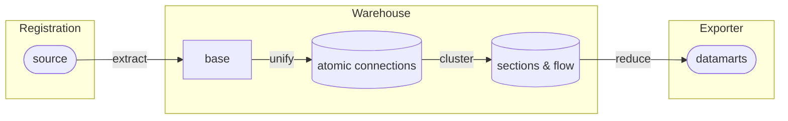

# Connectivity Extraction Process

## Extract Transform Load flow

Spatial Eye NetCon consists of several steps in which the information is processed:

Each of the steps has its own purpose and associated components:

| Step: | 1. Extraction | 2. Graph Model | 3. Section graph(s) | 4. Data Mart(s) |
| --- | --- | --- | --- | --- |
| Model | Base Model | Atomic Model | Section Model | Aggregation Model |
| Purpose | Gather connectivity | Structure all connectivity | Performance increase and reason logic | Prepare output for specific purpose |
| Configuration | Base Configuration | Fixed NetCon Model | Fixed Section Model and optional additional sections Configuration | Flow Calculation, CIM, Data Quality, KPI's, etc. export configurations |
## Registration specific connectivity extraction 

In principle any system that contains connectivity (aka topology) can be used as a source.

These systems are supported in particular:
* [[./Connectivity Extraction from Smallworld|Smallworld]]
* [[Connectivity Extraction from Utility Network Model|UNM]]

Please don't hesitate to contact us if you have another system, e.g. Intergraph.
