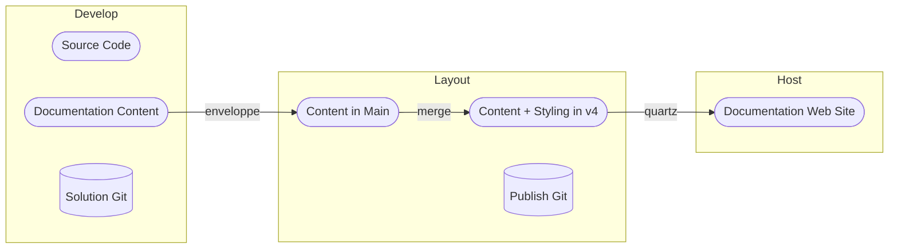

# Documentation Process

The documentation process should be:

* Trustable
* Have the documentation content registered in the git version control with the source code
* Be built on standard components
* Support:
	* Branding
	* Search
	* Translation
	* Reuse of shared content
* Scale

The process that has been currently drafted is depicted below:

Remarks:

* Working together
